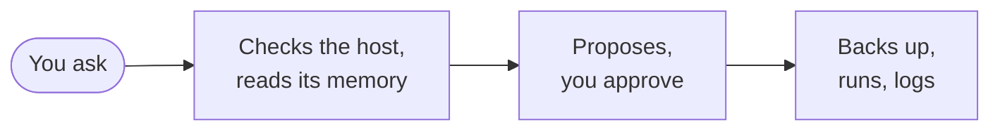

# Hostwarden

Hostwarden is a set of rules that turns an AI coding assistant —
Claude Code, OpenCode, or another terminal tool that reads project
files and runs shell commands — into a careful sysadmin. It manages
Linux, FreeBSD and macOS machines over SSH or locally, and reports on
Windows Server.

You describe what you need in plain language. Hostwarden works out the
commands for the system it detected, explains each one, and waits for
your approval before it runs. It installs nothing on your servers to do
so: no agent, no daemon, and no configuration management tool.

```
 ❯ Install postgresql on db1.example.com
 ❯ Run housekeeping on web1.example.com
 ❯ What goes down if pve1 reboots?
 ❯ Prüf auf allen Servern, ob nginx läuft
```

## How a request runs



- **Before the first command** on any host, the same pipeline runs:
  the blacklist and read-only lists, the SSH user, the host key, OS
  detection, the host's memory and what happened on it since the last
  session. There is no "quick question" exception.
- **Before any change** Hostwarden says what it will do and why, and
  waits. Destructive commands, firewall and network changes, reboots
  and restarts always ask; the worst ones are blocked outright
  ([Safety](../safety/index.md)).
- **After the change** a one-line headline goes into the server's own
  journal (`journalctl -t hostwarden`), and the full detail, with the
  way back, into your workspace
  ([Journal and changelog](../memory/journal.md)).

## What it remembers

Everything Hostwarden learns lives in `memory/`, the workspace: plain
Markdown files in a git repository of its own, one directory per host.
The next session, yours or a colleague's, reads them instead of
guessing. Out of the same files it draws Mermaid maps of your sites,
hypervisors and clusters. [Memory](../memory/index.md) shows what
those files look like.

## Where to go next

| You want to …                   | Read                                  |
| -------------------------------- | ------------------------------------- |
| see a session start to finish    | [First session](first-session.md)     |
| know what it can do              | [Features](../features/index.md)      |
| know what it will never do       | [Safety](../safety/index.md)          |
| see what it stores               | [Memory](../memory/index.md)          |
| install it                       | [Installation](install.md)            |
| run it for a team or unattended  | [Running it](../running-it/index.md)  |
| look up a prompt, skill, script  | [Reference](../reference/index.md)    |

:::caution

Hostwarden works on live servers — as root, with sudo, or unprivileged.
It follows its checklist every time, but a language model can still
misread a request or propose a command with side effects nobody
intended. Review every command before you approve it:
[Risks and responsibilities](../safety/index.md).

:::

Hostwarden continues [Heinzel](https://github.com/wintermeyer/heinzel)
by Stefan Wintermeyer as an independent project; coming from Heinzel,
see [Moving over from Heinzel](../running-it/heinzel.md).
