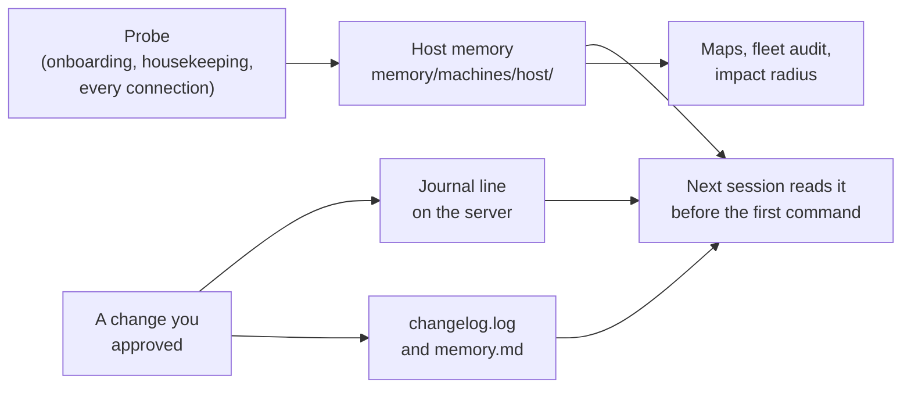

# How Hostwarden remembers

Hostwarden keeps no database and runs no service. What it learns about
your servers is written into plain Markdown files in `memory/`, the
**workspace** — a git repository of its own beside the Hostwarden
checkout. You can open every file in an editor, read its history with
`git log`, and share it with a team through a private remote.

## From probe to picture

1. **It learns by probing.** The first connection records what a host
   is — OS, hardware, network, services, accounts, backup, storage.
   Onboarding does it in full on request, housekeeping refreshes it,
   and every connection checks the version lines again.
2. **It records what it changed.** Every change leaves a one-line
   headline in the server's own journal and the full detail, with the
   way back, in your workspace.
3. **It reads before it acts.** Every session reads a host's memory,
   its open to-do items, your decisions for it and the journal of the
   last seven days before the first command.
4. **It shows it to you.** The files are the record; out of them
   Hostwarden draws maps, answers what a reboot would hit, and compares
   hosts in the fleet audit.

## What it records

| Where                           | What                            |
| ------------------------------- | ------------------------------- |
| `machines/<host>/memory.md`     | what the host is, ~30 lines     |
| `machines/<host>/network.md`    | its network profile             |
| `machines/<host>/guests.md`     | a hypervisor's guests           |
| `machines/<host>/storage.md`    | disks, pools and their settings |
| `machines/<host>/changelog.log` | every change, with the detail   |
| `machines/<host>/todo.md`       | an unfinished session's steps   |
| `machines/<host>/decisions.md`  | your standing choices for it    |
| `clusters/<name>/`              | a cluster's members and guests  |
| `topology.md`                   | sites, ranges, gateways, links  |
| `plans/`                        | work that spans sessions        |
| `maps/`                         | the generated Mermaid maps      |

The full list, and which files stay personal in a team:
[The workspace](workspace.md).

## Facts, not guesses

- **A gap stays a gap.** A field a probe could not read is written
  `unknown`, never filled in; a map draws it as "not known".
- **Records age.** What housekeeping records counts as stale after 90
  days. An answer that rests on a stale line says how old it is and
  which run refreshes it: `USB: recorded 140 days ago — housekeeping
  refreshes it`. The fleet audit lists stale hosts and hosts never
  onboarded.
- **The host wins.** When another machine's session worked on a host
  and its memory edits have not reached your workspace yet, Hostwarden
  trusts the host over the file.
- **Current facts only.** `memory.md` is a picture of now, kept short;
  history lives in the changelog and in git.
- **No secrets.** Memory files never hold a password, key or token —
  only where a credential lives and its permissions
  ([Secrets](../safety/secrets.md)).

## In this section

- [The workspace](workspace.md) — every file in `memory/`, personal and
  shared.
- [A host's memory](host-memory.md) — `memory.md`, `guests.md`,
  `storage.md` and `network.md`, with examples.
- [Journal and changelog](journal.md) — the two logs, what you see on
  connect, and how to read them yourself.
- [To-do lists and plans](todo-and-plans.md) — unfinished work.
- [Decisions](decisions.md) — choices you made, and why.
- [Infrastructure maps](maps.md) — Mermaid maps drawn from all of it.
