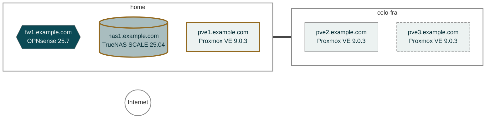
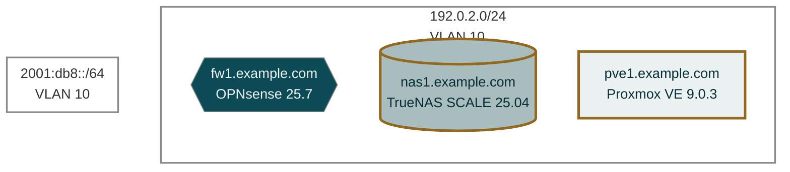
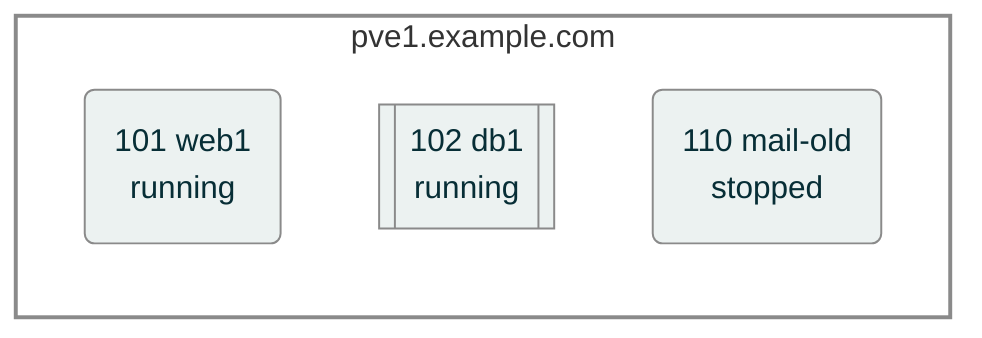
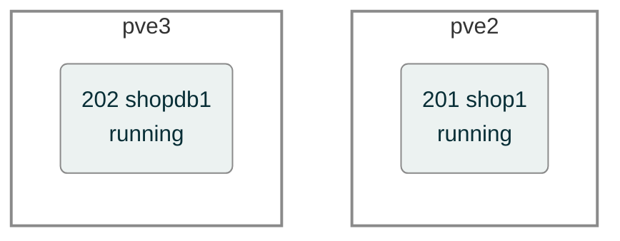

# Infrastructure maps

Out of what the workspace records, `bin/hostwarden-map` draws Mermaid
maps: the sites and the links between them, the ranges and hosts of each
site, and the guests of each hypervisor and cluster. The maps are
computed from memory alone, never drawn or edited by hand, so they
cannot drift from what Hostwarden knows. `bin/hostwarden-sync commit`
redraws them before every workspace commit, so a map is always committed
together with the memory it came from.

They are plain Markdown files with a Mermaid diagram first and a table
of the full fields after it, under `memory/maps/`. GitHub and Forgejo
render them with no build step; any Mermaid viewer does too.

## The levels

| File                       | Shows                                     |
| -------------------------- | ----------------------------------------- |
| `maps/README.md`           | the index, one line per map               |
| `maps/wan.md`              | sites, their gateways, the links between  |
| `maps/sites/<site>.md`     | a site's ranges and hosts                 |
| `maps/clusters/<name>.md`  | a cluster's members and guests            |
| `maps/hosts/<host>.md`     | a hypervisor outside a cluster, its guests|

Every node links back to the host's `memory.md` in the workspace. The
examples below are the real output for a small fictional workspace —
two sites, a firewall, a NAS, a standalone Proxmox VE host and a
two-node cluster — with those links left out, since the memory they
point to is not part of this site.

## WAN

Two sites, joined over the WAN. `nas1` and `pve1` carry a thick amber
border: a topology finding names them — here, `nas1` routes a range via
`pve1`, whose IPv4 forwarding is off. `pve3` has a dashed border: its
record is older than 90 days. The two sites are joined by the one
WAN link `memory/topology.md` records between them, a tunnel from
`home` to `colo-fra`. A site with no WAN link on record hangs off the
Internet node with a dashed grey line instead; here both have one, so
the Internet node stands alone.



Below the diagram, the file lists the sites, the site-to-site links and
the finding in full:

- **WARN** — nas1 routes 10.8.0.0/24 via 192.0.2.5 (pve1), and pve1's
  IPv4 forwarding is off (profile of 2026-09-20).

## A site

The site `home`, by range. The firewall is a hexagon, storage and
appliances are cylinders. The IPv6 range has no host drawn in it,
because the hosts' memory records IPv4 addresses.



## A hypervisor

`pve1` and its guests: VMs are rounded, containers have double edges. A
stopped guest is drawn as well — the guest list holds every guest,
running or not.



| ID  | Name     | Kind      | State   | IP         | Memory |
| --- | -------- | --------- | ------- | ---------- | ------ |
| 101 | web1     | VM        | running | 192.0.2.21 | memory |
| 102 | db1      | container | running | 192.0.2.22 | memory |
| 110 | mail-old | VM        | stopped | not known  | none   |

## A cluster

The cluster `prod`, each guest under the member it runs on right now.
After a live migration or an HA failover, the next inventory moves it.



## Reading a map

| Shape | Meaning |
| :--- | :--- |
| Hexagon, petrol | Router or firewall |
| Rectangle, frost | Hypervisor |
| Rounded, frost | VM or a plain server |
| Subroutine `[[ ]]`, frost | Container |
| Cylinder, stone | Storage or an appliance |
| Stadium, frost | An uplink |
| Dashed, light grey | Not known |
| Dashed border | Stale — older than 90 days |
| Thick amber border | A topology finding |
| Solid line | A LAN hop |
| Thick line | A WAN uplink |
| Dotted line | A tunnel or an overlay |

- **A gap is drawn as a gap.** A host with no site on record, a range
  no site claims, a field memory does not have: "not known", never a
  guess.
- **The date is the newest source.** The index names, per map, the
  newest memory it was drawn from.
- **Personal files stay out.** The maps never read `user.md`, the
  access lists or `ssh_config`, and never draw your own workstation, so
  a shared workspace can share its maps.

## The overview page

With the maps, `bin/hostwarden-map` writes `memory/README.md`, the page
GitHub and Forgejo show when the workspace opens and the one to read
first. It counts and links, and never repeats a host's detail, in this
order:

- **Sites**, each with its map and its number of hosts.
- **Services** and **critical hosts**.
- **Open findings**: per host, the counts of its last housekeeping run
  and security audit as its changelog records them, worst first, and
  the network's topology findings.
- **What expires within 90 days** and **backups without a tested
  restore**.
- **Not connected lately**: a host that fleet read reaches, its key
  line present, is due every night and listed after 2 days without
  contact, any other host after 90. Contact is the later of
  `Last connected:` and the host's newest changelog entry; a fleet run
  that could not read the host is not contact.

Memory does not record services, critical hosts, expiry dates or
restore tests yet, so each of those sections says so in one line and
names the issue that adds the question for them.

A `memory/README.md` you wrote yourself, without the generated-file
marker on its first line, is left as it is.

## Drawing them

```
bin/hostwarden-map
```

It runs locally, reads only the workspace, and writes only under
`memory/maps/` and `memory/README.md`. Run twice over the same memory on the
same day, it writes the same bytes, so a map only changes in git when the
infrastructure did. Across days, a host crossing the 90-day line turns
dashed — a map that never showed staleness would not be telling the
truth either.
